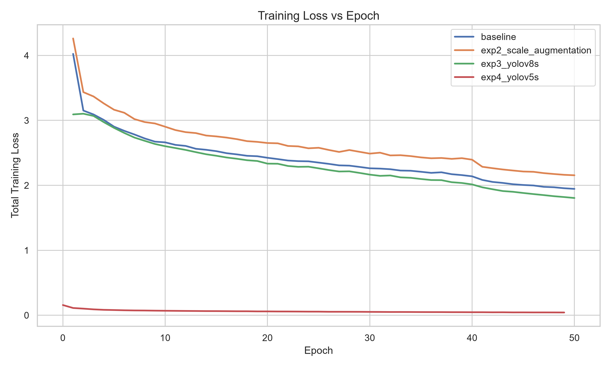
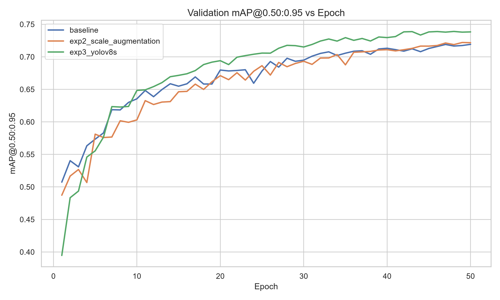
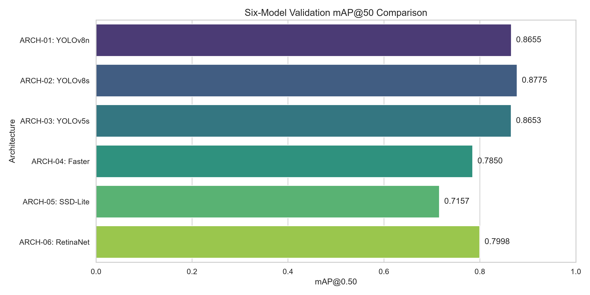
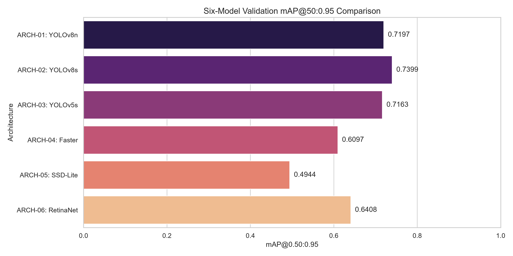
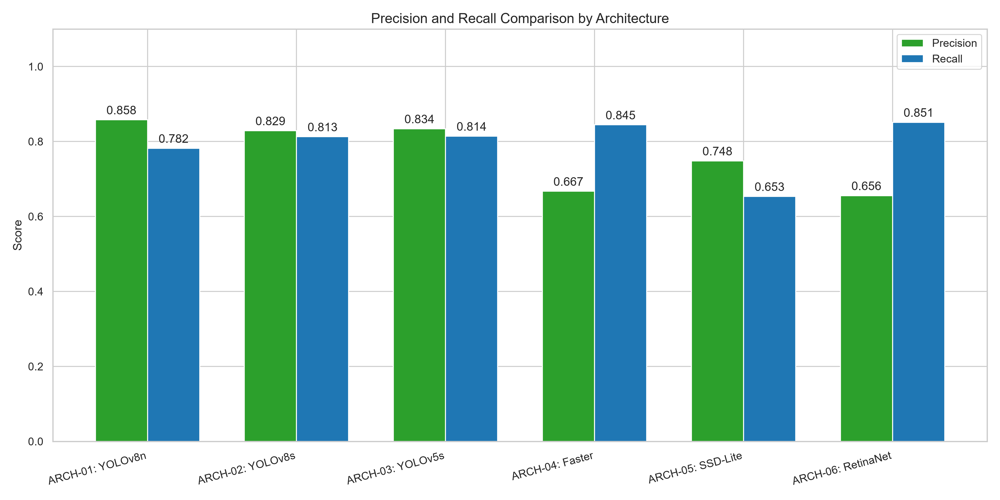
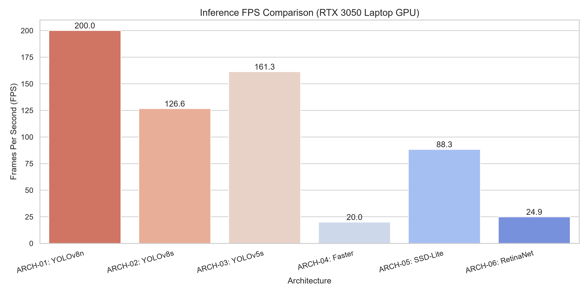
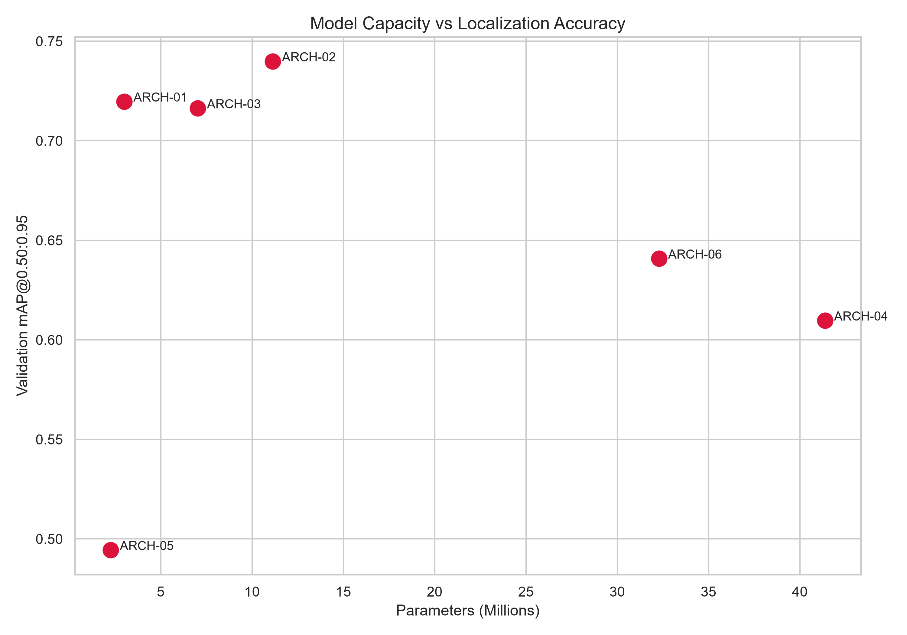
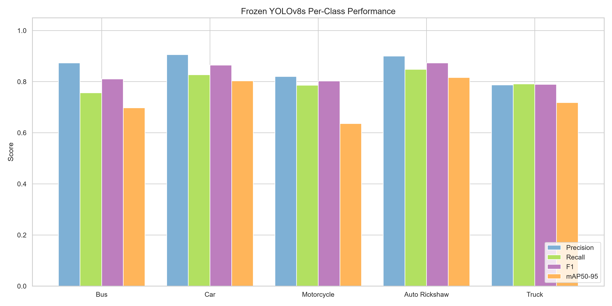

# VisionToll: Final Academic Visualizations

## Training Loss Curves
**Source Data**: results.csv from experiment directories
**Purpose**: Observe the convergence behavior of models during training.
**Evaluation Split**: Training Split
**Interpretation**: The models show typical exponential decay in training loss, successfully converging over the 50 epochs.

## Validation mAP@0.50:0.95 Curves
**Source Data**: results.csv from experiment directories
**Purpose**: Track the improvement of bounding box localization stringency over time.
**Evaluation Split**: Validation Split
**Interpretation**: Models quickly reach a plateau, with YOLOv8s showing the highest sustained mAP@0.50:0.95 performance.

## Six-Model mAP@50 Comparison
**Source Data**: final_model_comparison.csv
**Purpose**: Compare the raw detection capabilities of the six architectures at the standard 0.50 IoU threshold.
**Evaluation Split**: Validation Split
**Interpretation**: YOLOv8s and YOLOv8n achieve the highest mAP@50, demonstrating strong object discovery capabilities, while SSD-Lite underperforms.

## Six-Model mAP@50:0.95 Comparison
**Source Data**: final_model_comparison.csv
**Purpose**: Compare the fine-grained bounding box localization tightness across the six architectures.
**Evaluation Split**: Validation Split
**Interpretation**: YOLOv8s clearly separates itself from the baseline by achieving the highest tight-localization accuracy, breaking through the structural limitations of the nano model.

## Precision and Recall Comparison
**Source Data**: final_model_comparison.csv
**Purpose**: Analyze the tradeoff between false positives (Precision) and false negatives (Recall).
**Evaluation Split**: Validation Split
**Interpretation**: Two-stage architectures like Faster R-CNN and dense-anchor RetinaNet show heavy recall bias with lower precision, whereas YOLO models maintain a more optimal balance.

## Inference FPS Comparison
**Source Data**: final_model_comparison.csv
**Purpose**: Assess whether models meet real-time processing constraints for automated toll barriers.
**Evaluation Split**: Validation Split
**Interpretation**: YOLOv8n and YOLOv5s operate at extreme high speeds, while YOLOv8s comfortably exceeds the real-time threshold (126 FPS). Faster R-CNN is impractically slow (20 FPS).

## Model Capacity vs Localization Accuracy
**Source Data**: final_model_comparison.csv
**Purpose**: Visualize the efficiency frontier between computational footprint and detection quality.
**Evaluation Split**: Validation Split
**Interpretation**: YOLOv8s (ARCH-02) represents the optimal efficiency frontier, delivering the highest accuracy without requiring the massive 30M+ parameter overhead of RetinaNet or Faster R-CNN.

## Final Test Results: Per-Class Performance
**Source Data**: final_test_metrics.json
**Purpose**: Provide an authoritative breakdown of class-level performance on unseen data.
**Evaluation Split**: Test Split
**Interpretation**: The model maintains robust generalization across the board, with Car and Auto Rickshaw leading performance. Motorcycle remains the hardest class but securely maintains >0.60 tight-localization mAP.

## YOLOv8s Confusion Matrix
Data for a freshly generated confusion matrix plot is unavailable. The prediction-level N x N classification counts are not recorded in the final test metrics JSON artifact. As per instructions, this plot has been skipped to avoid data fabrication.